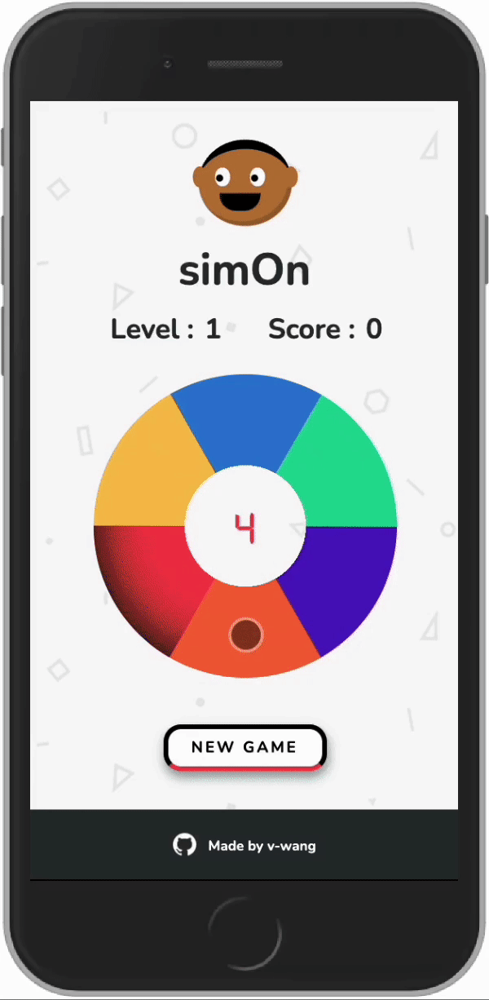

# simOn Game

## About

simOn, a memory game, is a version of Simon Says. At the start of each round, Simon will present a randomized sequence of colors before the player's turn. If the player can successfully repeat the sequence, they will move on to the next round. After each round, Simon's sequence length will increase. To win, the player must complete all rounds.

**[PLAY HERE](https://pages.git.generalassemb.ly/v-wang/simon/)**

---

  

## Game Instructions

1. Click **New Game** to start
2. Watch as Simon presents a sequence of colors
   - Simon will start Level 1 by showing two colors
   - Note that difficulty increases as you progress
3. At the end of Simon's turn, the player will repeat the sequence by selecting the colors on the wheel
4. If the player repeats the sequence correctly, they proceed to the next level
5. The game is over if the player fails to repeat the colors in the right order

## How to Win

Challenge yourself to see how far you can get! There is no final level. Hopefully, your memory improves and that's a win!

## Tech Stack

- JavaScript
- HTML
- CSS

## Installation

- No setup is required!
- simOn is optimized for mobile

## Upcoming Features

We hope to add more to simOn. Here's a shortlist of features up for consideration. Feel free to track our progress!

[simOn updates](https://thewangspace.notion.site/fade178304704ae5a2c748a2b21be50b?v=4962ddbbc4324b3c938f7df57dbbeec5)

- [ ] Multi color wheels
- [ ] Two tier difficulty

## Suggestions

Do you have an idea to improve the game? Feel free to send bug reports and/or feature requests to <midnightcoffeecode@gmail.com>
